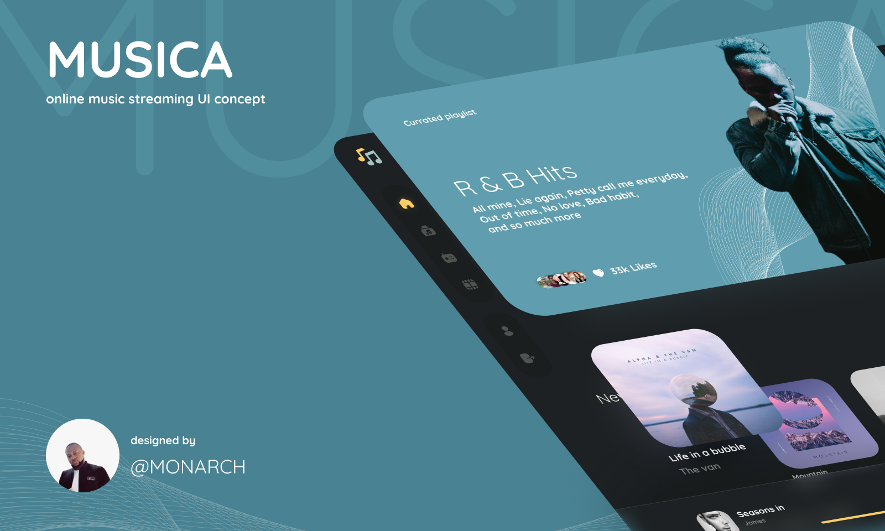

## Musica
#### Link to the live website: [Musica](https://musica-xi.vercel.app/ "Musica live site")
___

### Description 
A music webapp challenge by twitter user: [CodingOssy](https://twitter.com/codingossy "Codingosyy") built with React, ContextApi, TailwindCSS.
____

### Tech Used:
1. React
2. Git
3. Github
4. Vercel
5. React
6. React-router
7. TailwindCSS
___
### Design

#### Figma Link:
[Design](https://www.figma.com/file/pbwKUpfKPoAcBIgFoXFueS/Musica?node-id=98%3A194/ "Musica Figma design")

 
#### Figma Designer: [Monarch_dev](https://twitter.com/m0narch_dev "Monarch_dev")

### Future Feature
1. Request Data from an API (done)
2. Play, pause, shuffle, and loop audio data (pending)
3. Search (pending)
4. Like and collections

## Available Scripts

In the project directory, you can run:

### `npm start`

Runs the app in the development mode.\
Open [http://localhost:3000](http://localhost:3000) to view it in your browser.

The page will reload when you make changes.\
You may also see any lint errors in the console.

### Credits: 
1. Scythe
2. [Hemdee JS](https://twitter.com/SanusiMuhyideen "Sanusi Muhiydeen")